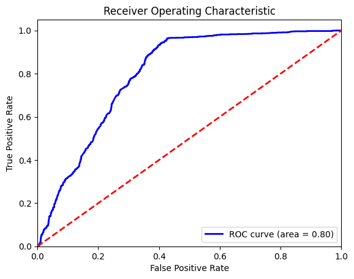
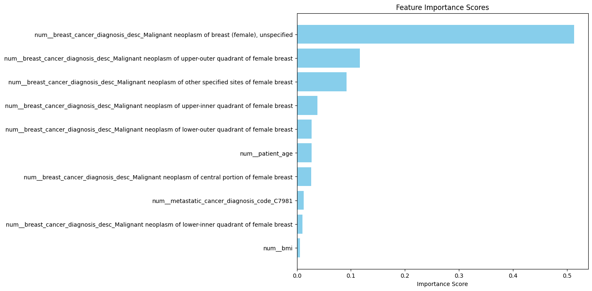
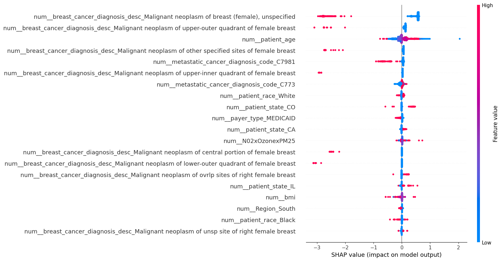
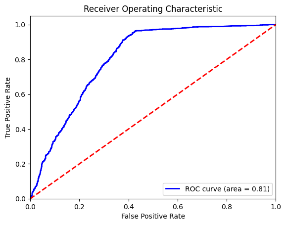
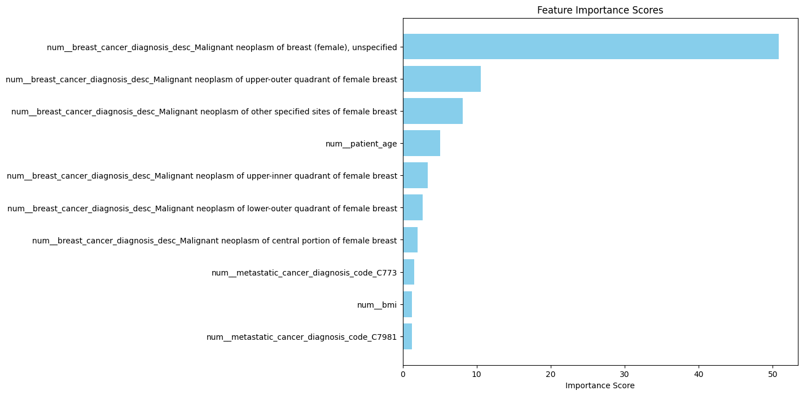
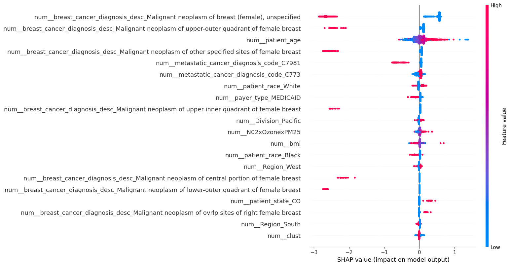

# WiDS Datathon 2024 Challenge #1

## Background

Women in Data Science (WiDS) Worldwide is on a mission to increase the participation of women in data science to benefit societies worldwide. Healthcare inequity is a global challenge, and addressing it positively impacts women’s health, which is crucial for societal and economic thriving. This datathon aims to discover whether disparate treatments exist and understand the drivers of these biases, such as demographic and societal factors.

## Overview: The Dataset and Challenge

Gilead Sciences is the sponsor for this year’s [WiDS Datathon](https://www.widsworldwide.org/learn/datathon/). They provided a rich, real-world dataset containing information about demographics, diagnosis, treatment options, and insurance for patients diagnosed with breast cancer from 2015-2018. The dataset originated from Health Verity, one of the largest healthcare data ecosystems in the US, and was enriched with third-party geo-demographic data to provide insights into the socio-economic aspects contributing to health equity. Additionally, it includes zip code-level toxicology data from NASA/Columbia University.

## Challenge Task

We need to predict whether a patient will be diagnosed with metastatic cancer within 90 days after screening.
To accomplish this task, we compared different models, including: logistic regression, random forest, gradient boosting, etc., and finally used the model with the best performance.

## Model Evaluation Report

This our report summarizes the evaluation of two classification models: **Gradient Boosting Classifier** and **CatBoost Classifier**. The performance metrics measured include **Precision**, **Recall**, **F1 Score**, **ROC AUC**, and **AUC-PR**. Additionally, feature importance scores and SHAP values were assessed for both models.

### Gradient Boosting Classifier
- **Precision**: 0.7903
- **Recall**: 0.9555
- **F1 Score**: 0.8651
- **ROC AUC**: 0.7997
- **AUC-PR**: 0.8193

#### Feature Importance
| Feature | Importance |
|---------|------------|
| num__patient_age | 0.0271 |
| num__bmi | 0.0059 |
| num__N02xOzonexPM25 | 0.0057 |
| num__clust | 0.0006 |
| num__is_female | 0.0014 |
| ... | ... |
| num__payer_type_MEDICARE ADVANTAGE | 0.0001 |
| num__patient_race_Black | 0.0019 |
| num__patient_race_Hispanic | 0.0006 |
| num__patient_race_Other | 0.0002 |
| num__patient_race_White | 0.0013 |

### CatBoost Classifier
- **Precision**: 0.7903
- **Recall**: 0.9604
- **F1 Score**: 0.8671
- **ROC AUC**: 0.8054
- **AUC-PR**: 0.8293

#### Feature Importance
| Feature | Importance |
|---------|------------|
| num__patient_age | 5.0785 |
| num__bmi | 1.2792 |
| num__N02xOzonexPM25 | 1.1999 |
| num__clust | 0.6618 |
| num__is_female | 0.1392 |
| ... | ... |
| num__payer_type_MEDICARE ADVANTAGE | 0.0687 |
| num__patient_race_Black | 0.4483 |
| num__patient_race_Hispanic | 0.1269 |
| num__patient_race_Other | 0.0416 |
| num__patient_race_White | 1.0804 |

### Conclusion
Both classifiers demonstrate strong predictive performance, with CatBoost having a slight edge in ROC AUC and AUC-PR metrics. Additionally, CatBoost appears to scale feature importance values significantly higher than Gradient Boosting, potentially due to differences in model architecture and how each model handles feature thresholds.

## Why is this project important?

Metastatic Triple-Negative Breast Cancer (TNBC) is considered the most aggressive form and requires urgent treatment. Delays in diagnosis and treatment can have devastating effects. Differences in wait times for treatment serve as a proxy for disparities in healthcare access. The primary goal is to detect relationships between patient demographics and the likelihood of timely treatment. The secondary goal is to assess whether environmental hazards impact proper diagnosis and treatment.

## Questions?

For any inquiries, please contact telegram: @AvgusTa_X

